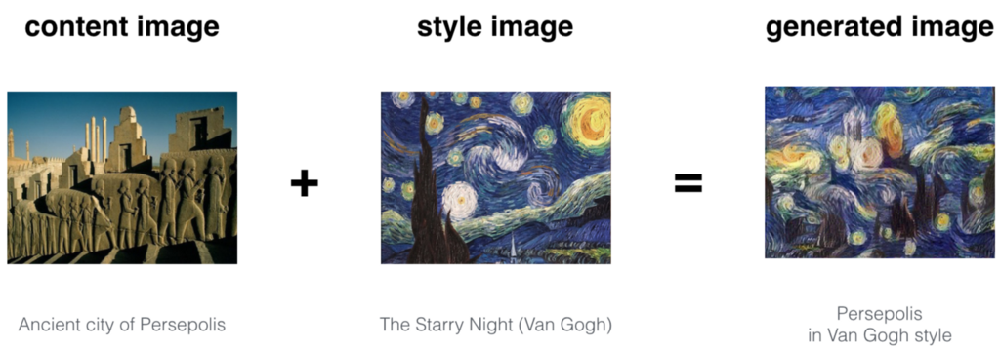
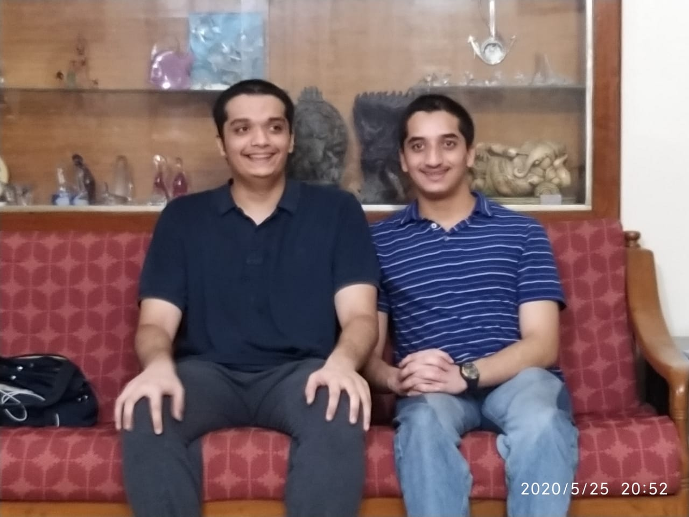
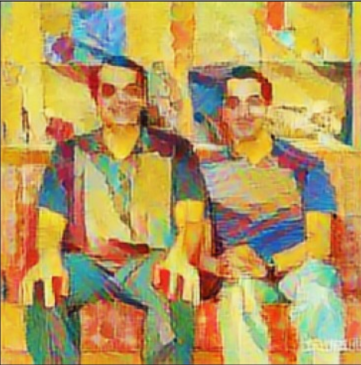

Neural Style Transfer app
---

I made this app to practice React.js and to learn how to use material UI. 

The backend API is a <a href="https://github.com/hhn20/nst-hadhru">flask app</a> made using the code from tensorflow hub

## Instructions
1. Enter the URL of any content image:

2. Enter the URL of any style image:

3. With the click of a button, the style will be transfered from your style image to your content image!

---

go to src/images for more samples
